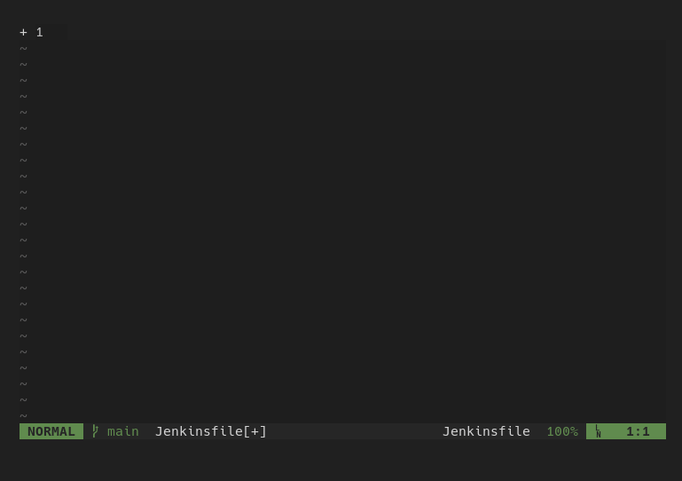

# cmp-jenkinsfile

simple completion utilizing the `IntelliJ IDEA GDSL` file that gets generated for installed jenkins plugins. 

*example gdsl*

```
method(name: 'parallel', type: 'Object', params: ['closures':'java.util.Map'], doc: 'Execute in parallel')
method(name: 'parallel', type: 'Object', namedParams: [parameter(name: 'closures', type: 'java.util.Map'), parameter(name: 'failFast', type: 'boolean'), ], doc: 'Execute in parallel')
```

## demo



## options

**jenkins_url**: full jenkins url to download the gdsl from.
  
example: `http://jenkins.lab/`

`/pipeline-syntax/gdsl` will automatically be append to the end of the url.

**gdsl_file**: full path to either download to or statically read from.

If `jenkins_url` is supplied then this file will be written to. If `jenkins_url` is blank then only read from the supplied path

defaults to: `$HOME/.cache/nvim/cmp-jenkinsfile.gdsl`


**Recommended Config:**

put this in your `init.lua`

it will only activate the `jenkinsfile` source if the file type = `Jenkinsfile`

```lua
 vim.cmd[[
 autocmd FileType Jenkinsfile lua require'cmp'.setup.buffer {
    \   sources = {
    \     { name = 'jenkinsfile',
    \        opts = {
    \            jenkins_url = "http://jenkins:8080"
    \        }
    \     },
    \     { name = 'buffer' },   -- you have to list out other sources you 
    \     { name = 'ultisnips' } -- want to be present in Jenkinsfile
    \   },
    \ }
 ]]
```
